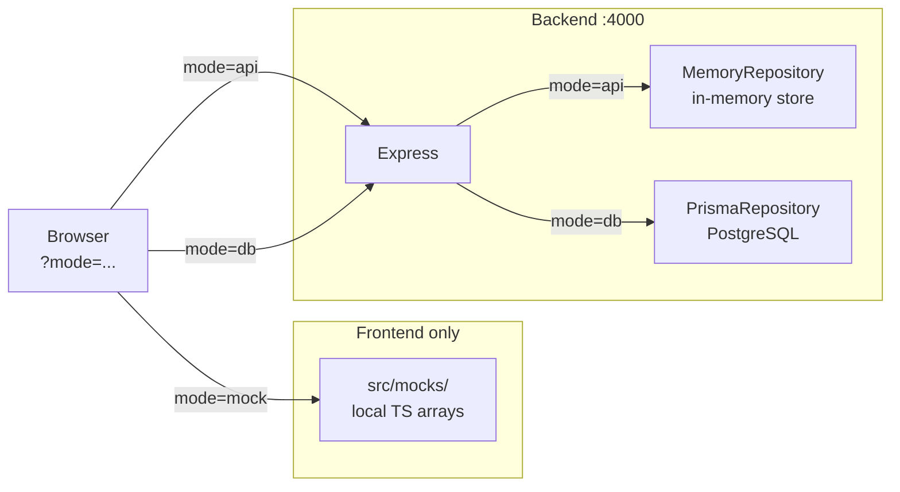

# Product Catalog Learning Platform

<p align="center">
  
  
  
  
  
  
  
</p>

<p align="center">
  Proyecto bilingüe de onboarding para enseñar arquitectura full-stack con un ejemplo real.<br>
  Bilingual onboarding project for teaching full-stack architecture through a real example app.
</p>

---

## El concepto central / Core concept: three data modes

La misma UI puede cargar datos desde tres fuentes distintas. El modo se cambia con `?mode=mock|api|db` y es visible en la pantalla, no está oculto en el código.

The same UI can load data from three different sources. The mode is switched with `?mode=mock|api|db` and is always visible on screen, never hidden in code.



| | `mock` | `api` | `db` |
|---|---|---|---|
| **Datos desde** | `frontend/src/mocks/` | Express + memoria | Express + PostgreSQL |
| **Backend necesario** | No | Sí | Sí |
| **Base de datos** | No | No | Sí |
| **Archivo clave** | `mocks/products.ts` | `memory-catalog.repository.ts` | `prisma-catalog.repository.ts` |

### Cómo se ve en la UI / How it looks in the UI

| Mode `mock` | Mode `api` | Mode `db` |
|:-----------:|:----------:|:---------:|
|  |  |  |
| Sin backend, datos locales | Backend activo, sin PostgreSQL | Backend + PostgreSQL activos |
| No backend, local data | Backend active, no PostgreSQL | Backend + PostgreSQL active |

> [!TIP]
> Reemplaza estas imágenes con capturas reales guardando los screenshots en `docs/images/` y actualizando los enlaces de arriba.
>
> Replace these with real screenshots by saving them to `docs/images/` and updating the links above.

---

## Qué incluye este repositorio / What's inside

- `frontend/` — Next.js + TypeScript + Tailwind CSS + App Router
- `backend/` — Express + TypeScript + Zod + service/repository structure
- `docs/` — arquitectura, onboarding, deployment, Docker, variables de entorno y más

El dominio es simple a propósito: un catálogo de productos con experiencia pública y panel admin semi-funcional.  
The domain is intentionally simple: a product catalog with a public experience and a semi-functional admin panel.

> [!NOTE]
> El frontend incluye rutas de arquitectura interactivas: `/architecture`, `/architecture/frontend`, `/architecture/backend`, `/architecture/data-flow`, y más. Son parte del producto, no documentación externa.
>
> The frontend includes interactive architecture routes: `/architecture`, `/architecture/frontend`, `/architecture/backend`, `/architecture/data-flow`, and more. They are part of the product, not external docs.

---

## Inicio rápido / Quick start

### Desarrollo local / Local development

1. Copia los archivos de entorno:

```bash
cp frontend/.env.example frontend/.env.local
cp backend/.env.example backend/.env
```

2. Instala dependencias desde la raíz:

```bash
npm install
```

3. Inicia PostgreSQL localmente o usa Docker solo para la base de datos.

4. Genera Prisma Client, aplica migraciones y carga seed:

```bash
npm run db:generate
npm run db:migrate
npm run db:seed
```

5. Inicia frontend y backend juntos:

```bash
npm run dev
```

Frontend: `http://localhost:3000`  
Backend: `http://localhost:4000/api`

### Docker (todo incluido / all-in-one)

```bash
docker compose up --build
```

Revisa [docs/DOCKER.md](docs/DOCKER.md) para la explicación completa.  
See [docs/DOCKER.md](docs/DOCKER.md) for the full explanation.

---

## Estructura / Structure

```text
project-root/
  frontend/     Next.js app
  backend/      Express API
  docs/         Guides and architecture docs
```

Más detalle en [docs/FOLDER-STRUCTURE.md](docs/FOLDER-STRUCTURE.md).  
More detail in [docs/FOLDER-STRUCTURE.md](docs/FOLDER-STRUCTURE.md).

---

## Orden recomendado de lectura / Recommended reading order

1. [docs/ONBOARDING-GUIDE.md](docs/ONBOARDING-GUIDE.md)
2. [docs/ARCHITECTURE.md](docs/ARCHITECTURE.md)
3. [docs/DATA-FLOW.md](docs/DATA-FLOW.md)
4. [docs/MOCK-VS-API-VS-DB.md](docs/MOCK-VS-API-VS-DB.md)
5. [docs/CODEX-FINAL-REPORT.md](docs/CODEX-FINAL-REPORT.md)

---

## Git para onboarding / Git workflow

Los mensajes de commit deben escribirse en inglés con prefijos Conventional Commits.  
Commit messages should be written in English using Conventional Commit prefixes.

```
feat(frontend): scaffold app router structure
feat(backend): add catalog routes with service and repository
feat(db): add Prisma schema and seed script
docs(project): add onboarding and architecture guides
```

---

## Deployment

| Servicio | Plataforma recomendada |
|----------|----------------------|
| Frontend | Vercel |
| Backend  | Railway o Render |
| Database | Neon o Render Postgres |

Más detalle en [docs/DEPLOYMENT.md](docs/DEPLOYMENT.md).
